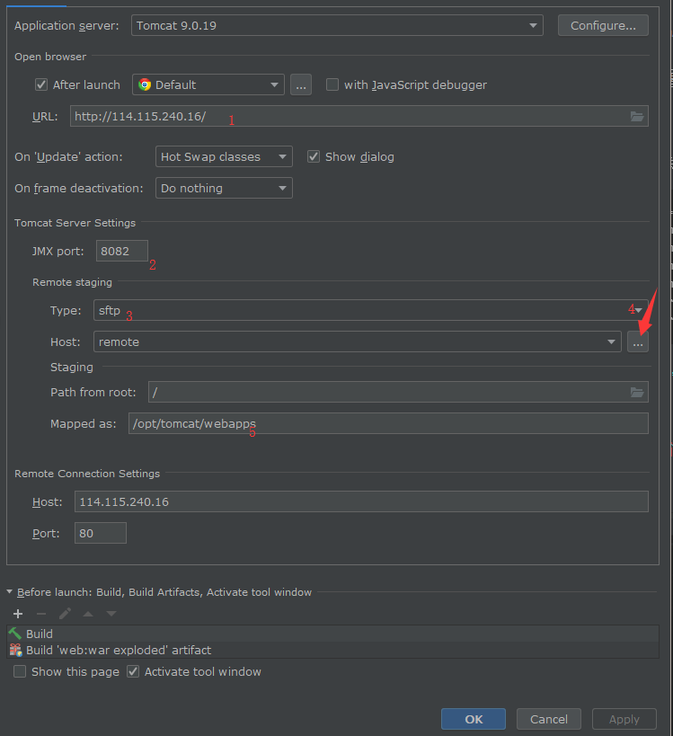
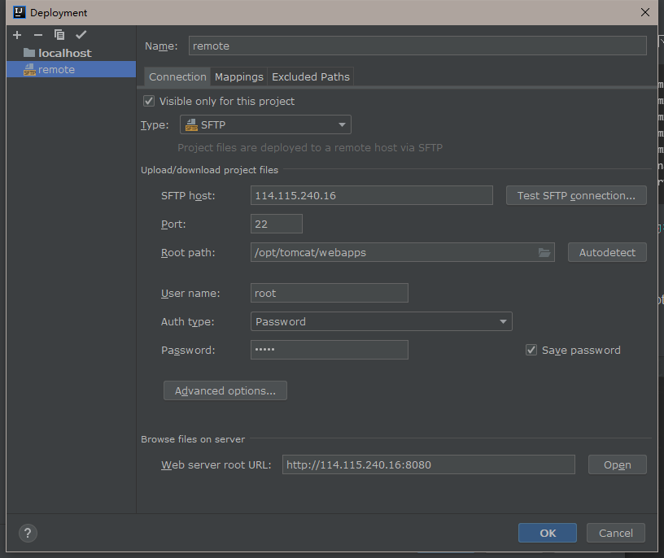

# 部署文档

## 需求条件 

### 硬件需求

- 服务器推荐使用Ubuntu 16.04 LTS作为服务器系统；
- 服务器应保证至少有2G空余内存和10G左右的空闲硬盘空间；
- 服务器应保证空闲时有至少1核左右的空余CPU；
- 服务器应保证互联网通畅并拥有公网IP；
- 服务器应保证有一块与公网IP相对应的网卡并且有空闲端口。

### 软件依赖

- JDK版本: jdk-11.0.2
- Maven版本: Apache Maven 3.6.1
- Tomcat版本: Apache Tomcat/9.0.20
- MySQL版本: 5.7

### IDE 

- Intellij IDEA 

## 项目部署

### 依赖安装

#### JDK安装

因为服务器环境是Ubuntu 16 ，apt较老，所以需要tar安装

    wget https://download.java.net/java/GA/jdk11/28/GPL/openjdk-11+28_linux-x64_bin.tar.gz
    sudo tar xfvz /tmp/openjdk-11+28_linux-x64_bin.tar.gz 
    rm -f /tmp/openjdk-11+28_linux-x64_bin.tar.gz

然后配置Java环境变量

    export JAVA_HOME= #安装的路径
    export CLASSPATH =.: ${JAVA_HOME}/lib
    export PATH = ${JAVA_HOME}/bin:PATH

#### Maven安装

下载tar

    wget http://www-eu.apache.org/dist/maven/maven-3/3.6.1/binaries/apache-maven-3.6.1-bin.tar.gz
    sudo tar xfvz apache-maven-3.6.1-bin.tar.gz

配置Java环境变量
    
    export M2_HOME=/opt/maven
    export M2=$M2_HOME/bin
    export PATH=$M2:$PATH
    
#### Tomcat安装

    wget https://www-us.apache.org/dist/tomcat/tomcat-9/v9.0.21/bin/apache-tomcat-9.0.21-deployer.tar.gz
    sudo tar xfvz apache-tomcat-9.0.21-deployer.tar.gz
    
 启动tomcat
    
    ./bin/startup.sh
 
 默认监听的8080端口，这时候打开网页(本地是localhost:8080，远程是url:8080)应该可以看到tomcat的页面
    

#### MySQL安装

注意记录密码

    sudo apt-get install mysql-server
    sudo apt install mysql-client

### 数据库构建

使用web/SQL/all.sql里的内容构建数据库

注意将web/src/main/resources/conf/db.properties里面的连接方式，密码等改成自己设置的

### IDEA远程部署 

网站部署的方式有很多，这里选择IDEA自带的远程部署功能，方便更新和调试

#### 服务器端

首先在环境变量里添加以下几行

    export JAVA_OPTS="-Dcom.sun.management.jmxremote=x
    -Dcom.sun.management.jmxremote.port=8082
    -Dcom.sun.management.jmxremote.rmi.port=8082
    -Dcom.sun.management.jmxremote.ssl=false
    -Dcom.sun.management.jmxremote.authenticate=false
    -Djava.rmi.server.hostname=114.115.240.16
    -agentlib:jdwp=transport=dt_socket,address=8083,suspend=n,server=y"

注意端口和ip的设置，因为华为云只开了8000-10000的端口，所以这边随便选了俩

#### 本地IDE配置

在IDEA里面添加一个remote Tomcat

配置如下

特别注意的是JMX端口、ip的设置要和上一步相同

然后点击运行就可以查看网站的效果了