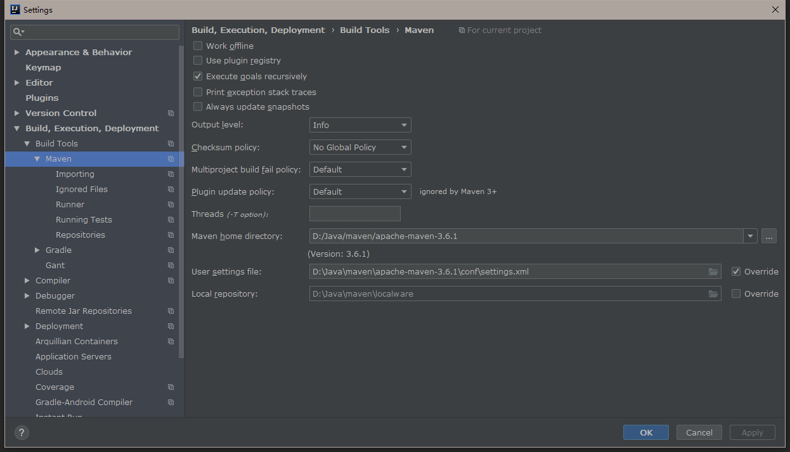
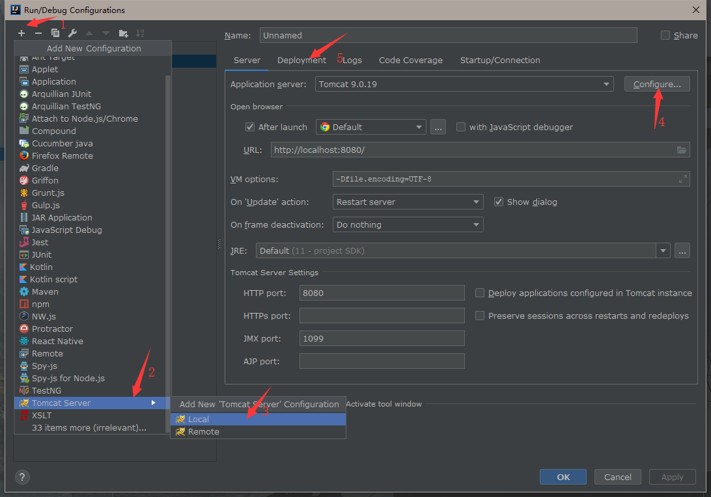
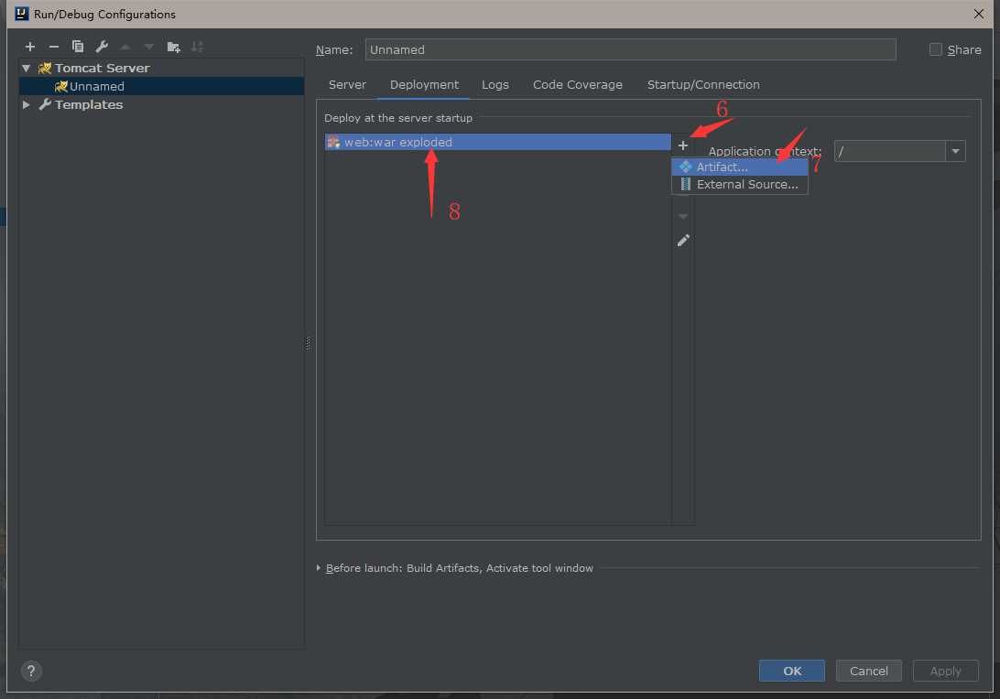

# 如何使用IDEA运行git上的程序

## 下载代码

git的操作，不用多说吧

## 配置Maven

首先确认一下IDEA的maven，打开设置，找到Maven选项（我的是自己额外配的，IDEA有自带）



修改一下usersettingsfile里的那个文件，换成国内源

```xml
    <!--大概在140行左右，mirrors里面加上这个-->
   <mirror>  
            <id>alimaven</id>  
            <name>aliyun maven</name>  
            <url>http://maven.aliyun.com/nexus/content/groups/public/</url>  
            <mirrorOf>central</mirrorOf>          
    </mirror>  
```


## 配置TomCat

首先下载Tomcat，用的版本是9.0.19

然后IDEA点击Run -> Edit Conf，接着按图示顺序添加Tomcat，其中configure是选择刚下载的tomcat的位置，






## 修改代码配置文件

主要是两个文件

一是\web\src\main\resources\conf\db.properties文件里面的数据库连接，包括数据库名和本地密码（mysql连接字符串）

二是\web\src\main\resources\conf\log4j.properties文件里面的log文件输出位置(.File)

## Run

最后点IDEA右上角那个绿色小箭头就可以跑起来了，你会看到浏览器里面新打开一个页面写着index

##  杂项

可能会有一些细节上的问题，比如UTF8等，建议自行搜索
