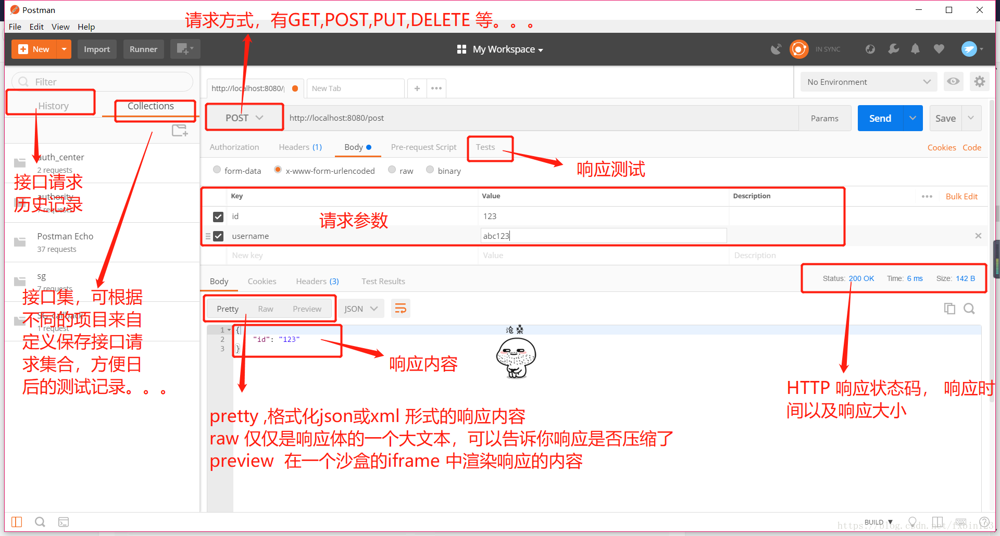
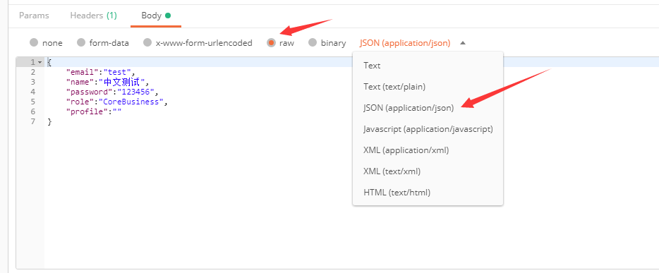

# 如何使用postman查看api文档和进行测试

## postman

为什么要使用postman？

我们此次实现的程序是一个完全的REST Api，在网页中打开你会发现程序的输入输出都是json数据，只不过是通过url来访问程序罢了。

那么就带来一个问题，使用浏览器无法进行测试，比如传递参数什么的，而自己手动编写测试页面（HTML+JS）太麻烦。

postman就是一款很好的api测试程序。

## postman的下载

自行下载

## postman的使用

一图流

## Postman生成API文档

https://crifan.github.io/api_tool_postman/website/postman_api_doc/

## 特别注意

我们的程序没有使用表单，全都是json进json出，所以指定参数的时候不能用formdata，而是用json

## 杂项

postman上一些HTTP相关名词建议自行搜索理解